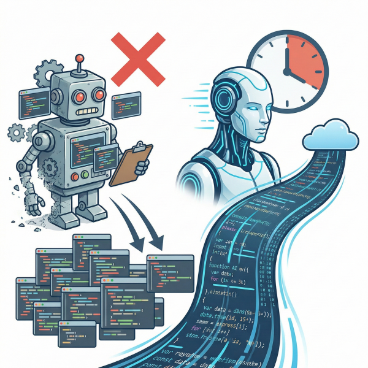
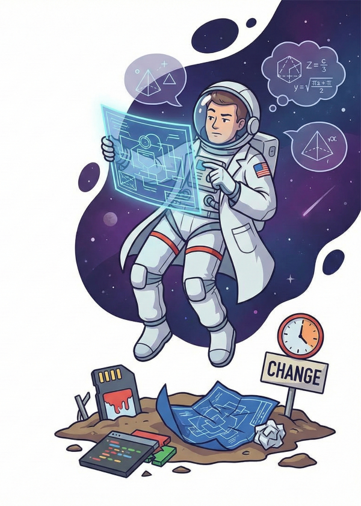
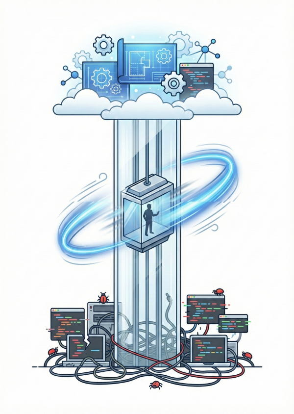
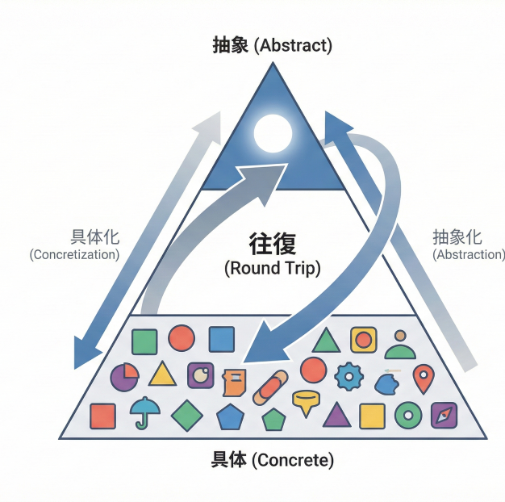

<!-- _class: title　-->
<!-- _paginate: false -->


# エンジニアとしての考え方
Ver.1.0

(C) 2026 ponpon.USA

---

<!-- _class: section -->
<!-- _paginate: false -->

## #1 あなたの「仕事」は何ですか？

---

<!-- _class: align-center all-text-center no-header -->

# あなたの「仕事」は何ですか？

## 「コードを書くこと」ですか？ いいえ、それは**作業**です。

# エンジニアの本質は **「翻訳家」** です。

<div class="highlight-box">
  <b>Human (具体・曖昧)：</b>「なんとなく、こんな機能が欲しいんだよね」<br>
  <b>Computer (抽象・論理)：</b> `0` と `1`、厳密なロジック
</div>

# この間にある「**翻訳**」こそが、我々の**バリュー**です。

---

<!-- _class: section -->
<!-- _paginate: false -->

## #2 「具体」と「抽象」

---

<!-- _class: align-center content-image-right no-header -->


# 1. 「具体」とは何か？ (N=1)

### 例：目の前にある「ツナマヨおにぎり」
<br>

```text
・セブンイレブンの商品
・150円
・海苔がパリパリしている
・消費期限：2026/01/31
```

* わかりやすい、実体がある
* **N=1**（その場限り）
* 応用が効かない
  * （鮭おにぎりにはなり得ない）

---

<!-- _class: align-center content-image-right no-header -->


# 2. 「抽象」とは何か？ (N=∞)

### 例：情報を捨てて「軽食」と呼ぶ
<br>

```math
1 + 2 = 3   // 具体 (N=1)
    ↓
x + y = z   // 抽象 (N=∞)
```

* 情報を捨てる（価格、具材、数字を捨てる）
* **N=∞**（無限のパターンに対応可能）
* **プログラミングの本質**
  * 変数、クラス、インターフェース

---

<!-- _class: content-image align-center all-text-center no-header -->


## 抽象から具体へのイメージ（逆の場合も）

---

<!-- _class: section -->
<!-- _paginate: false -->

## #3「具体の世界の住人」と「抽象の世界の住人」

---

<!-- _class: no-header all-text-center align-center -->

# あなたはどちらの住人ですか？

---

<!-- _class: align-center content-image-right content-60 no-header -->



# 例１：具体の世界の住人

### 「コピペbot」になっていませんか？
<br>

* 「とりあえず動きました（理由は知りません）」
* 「サンプルコードがないと作れません」
* **応用力がない** ⇒ 環境が変わると新人以下になる。
<br>

> **残酷な現実**
> AIの方が、あなたより早く正確にコピペできます
> 具体だけのエンジニアは、数年以内に淘汰されます

---

<!-- _class: align-center content-image-left content-60 no-header -->



# 例２：抽象の世界の住人

### 「アーキテクチャ宇宙飛行士」になっていませんか？
<br>

* 「理論的には可能です」
* 「べき論」しか語らない
* **成果物がない**
<br>

> **残酷な現実**
> 現場の「泥臭さ（メモリ制限、遅延、仕様変更）」を無視した設計図は、開発の現場ではただのゴミです

---

<!-- _class: no-header all-text-center align-center -->

# どちらかだけではサービスは開発できません
<br>

### 「動けばいい」と「あるべき論」の**間**にこそ、我々の仕事があります。
<br>

## 具体と抽象の階段を上り下りし、
## 理想を現実に落とし込む「**翻訳能力**」こそが、
## 開発に不可欠なスキルなのです。

---


<!-- _class: section -->
<!-- _paginate: false -->

## #4 解法：高速の「往復運動」

---

<!-- _class: align-center content-image-right content-70 no-header -->



# 優秀なエンジニアのエレベーター
<br>

#### 1. **抽象（設計）** から **具体（実装）** へ降りる
#### 2. **具体（バグ・制約）** にぶつかり、**抽象（再設計）** へ戻る
<br>

### この昇降速度が、異常に速い。

#### > 作ってみて（具体）、ダメだと気づき、設計直す（抽象）
#### > このループを回せる人だけが、生き残る

---

<!-- _class: align-center content-image-left content-60 no-header -->



# 往復が生む「ピラミッドの進化」
<br>

### ただの往復ではありません
<br>

#### > 具体を知ることで、**より精度の高い抽象**が描ける
#### > 抽象を知ることで、**より広範囲な具体**に対処できる
<br>

### **認知領域（ピラミッド）の拡大**
#### 往復するたびにエンジニアとしての「格」が上がっていく

---

<!-- _class: no-header all-text-center align-center -->

# One more thing...

---

<!-- _class: no-header all-text-center align-center -->

# 今、こう思いませんでしたか？
<br>

# 「**なるほど、勉強になった**」
# 「**成長した気がする**」

---

<!-- _class: no-header all-text-center align-center -->

# それが、最大の**罠**です
<br>

### 「わかった気」になって**脳内麻薬**（ドーパミン）が出ているだけです
<br>

<div class="highlight-box">
  <b>サッカーの試合を見て、自分も上手くなったと <span class="red-accent-text">錯覚する観客</span>と同じ</b><br>
  <b>あなたのスキルは、まだ <span class="red-accent-text">1ミリも上がっていません</span></b>
</div>

---

<!-- _class: no-header all-text-center align-center -->

# 本当の「成長」とは
<br>

### **「わからない」** ともがき苦しむ
### **「言語化できない」** と冷や汗をかく
### 自分の頭で考え、自分の言葉で出力した瞬間にしか起きない
<br>

> &nbsp;
> Input (0%) → Process (Wait...) → **Output (100%)**
> &nbsp;

<br>

### この繰り返しです
### 汗をかいていない時間は、成長していない時間です

---

<!-- _class: no-header all-text-center align-center -->

# And finally...

---

<!-- _class: no-header all-text-center align-center -->

# 教える側と教わる側の関係性

---

<!-- _class: no-header all-text-center align-center -->

# 色々な立場や役割があると思います
# 教師と生徒、講師と受講生、先輩と後輩、師匠と弟子......
<br>

# この関係に上下関係はありますか？
# 利害関係はどうでしょうか？

---

<!-- _class: no-header all-text-center align-center -->

# 教わる側の「致命的なリスク」


## **講師（私）を信じないでください**
<br>

> &nbsp;
> **私が間違った地図（古い技術、誤った解釈）を渡すかもしれない**
> **あなたが求めていた場所に行けなくても、私は責任を取れないし取らない**
> **道に迷い、キャリアという貴重な時間を失うのは <span class="red-accent-text">「あなた」</span> です**
> &nbsp;

<br>

## 「**教わる**」とは、それほどハイリスクなギャンブルです

---

<!-- _class: no-header all-text-center align-center -->

# あるべきスタンス

## **「生徒」ではなく「審査員」になれ**
<br>

> &nbsp;
> **「勉強させてください」という受け身をやめる**
> **「こいつの言ってることは本当か？」と <span class="red-accent-text">疑い、検証する</span>**
> **昨日までの自分は本当に正しくなかったのか？**
> **今までの積み重ねは間違っていたのか？**
> **それくらいの意識で、そして私を論破するつもりで聞いてください**
> &nbsp;

<br>

## その「**疑うプロセス**」こそが、あなたをアーキテクトにします

---

<!-- _class: no-header all-text-center align-center -->

# だから、「出力（レクチャー）」させます

## **次回の主役は皆さんです**
<br>

> &nbsp;
> <span class="red-accent-text">【 Rule 】</span>
> **翌日以降、持ち時間５分のレクチャーを行ってもらいます**
> **今日の内容を<span class="red-accent-text">「自分の言葉」</span> で誰かに説明できるように再構築してください**
> **順番は自分たちで決めてください（じゃんけんでもなんでも）**
> &nbsp;

<br>

### 私のためではありません
### 皆さんが「観客席」から降りて、「フィールド」に立つための強制ギプスです

---

<!-- _class: no-header all-text-center align-center -->

# **次回予告**
<br>

# 鉄道から学ぶ「アーキテクチャ」の正体
<br>

# **解散！！**