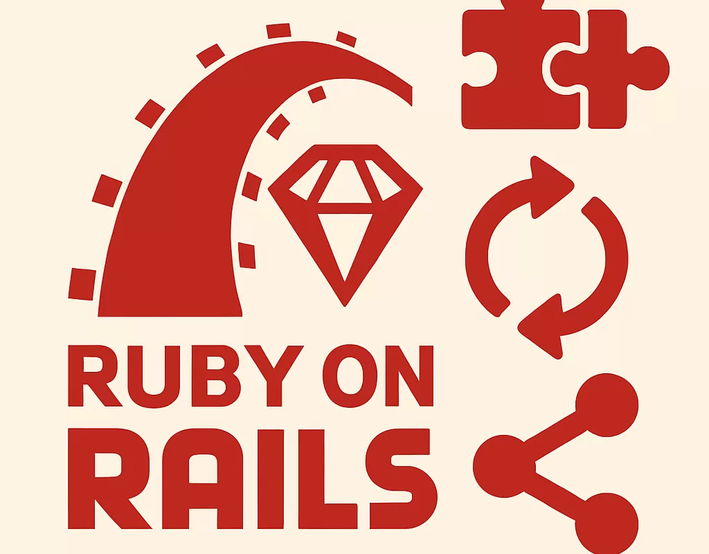
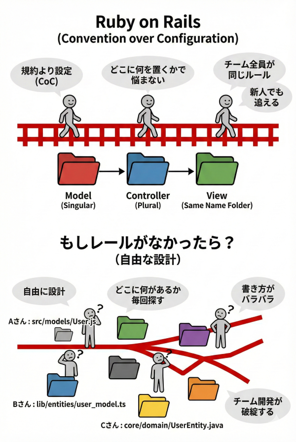
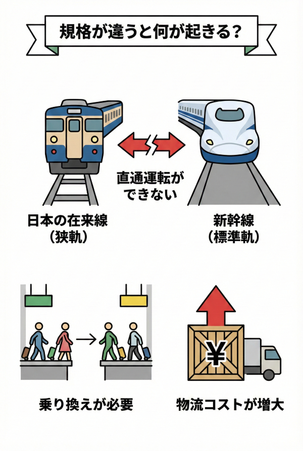
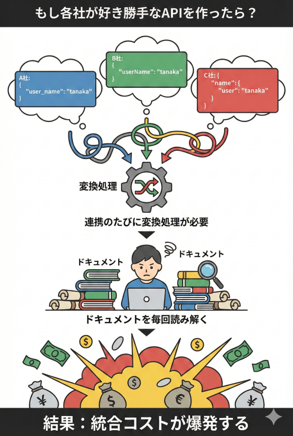

<!-- _class: title -->
<!-- _paginate: false -->


# 鉄道から学ぶアーキテクチャ #1
## 自由を捨てる勇気 — なぜ「レール（制約）」が必要か？

2026-01-20
ponpon.USA

---

<!-- _class: section -->
<!-- _paginate: false -->

## 前回の振り返り

---

<!-- _class: no-header all-text-center align-center -->

# 「具体」と「抽象」

<br>

### エンジニアの本質は「翻訳家」
### 具体と抽象の階段を上り下りする能力が求められる

<br>

## 今日から、その「抽象化能力」を
## **鉄道**というメタファーで鍛えていきます

---

<!-- _class: section -->
<!-- _paginate: false -->

## #1 荒野を走る車 vs レールを走る電車

---

<!-- _class: no-header all-text-center align-center -->

# 質問です

<br>

# 「自由」と「制約」
# どちらが**速く**走れますか？

---

<!-- _class: align-center content-image-right content-60 no-header -->


# 荒野を走る車

<br>

### 360度、どこへでも行ける「自由」

<br>

* どこへ曲がるか？ 常に**判断**が必要
* 道なき道を進むには**認知リソース**を消費
* 結果：スピードは出せない

---

<!-- _class: align-center content-image-left content-50 no-header -->


# レールを走る電車

<br>

### レールの上しか走れない「不自由」

<br>

* 行き先は**決まっている**
* 判断不要、迷いなし
* 結果：**時速300km** が出せる

---

<!-- _class: no-header all-text-center align-center -->

# 制約が「速さ」を生む

<br>

<div class="highlight-box">
  <b>自由（選択肢が多い）</b> = 判断コストが高い = 遅い<br>
  <b>制約（選択肢が少ない）</b> = 判断コストが低い = <span class="green-accent-text">速い</span>
</div>

<br>

## 「自由を捨てる」ことで、
## 初めて**高速化**が可能になる

---

<!-- _class: section -->
<!-- _paginate: false -->

## #2 ITにおける「レール」とは？

---

<!-- _class: no-header all-text-center align-center -->

# 我々の「レール」は何か？

<br>

### HTTP、REST、SQL、命名規則、フレームワーク...

<br>

## これらは「創造性の阻害」ではない
## **「判断コストの削減」** である

---

<!-- _class: align-center content-image-right content-50 no-header -->



# 例：Ruby on Rails

<br>

### 「規約より設定（CoC）」

```text
・モデルは単数形、テーブルは複数形
・コントローラは複数形
・ビューはコントローラと同名のフォルダ
```

<br>

* 「どこに何を置くか」で**悩まない**
* チーム全員が**同じルール**で動ける
* 新人でもすぐにコードを追える

---

<!-- _class: align-center content-image-left content-60 no-header -->



# もしレールがなかったら？

<br>

### 各自が「自由」に設計すると...

```text
・Aさん: src/models/User.js
・Bさん: lib/entities/user_model.ts
・Cさん: core/domain/UserEntity.java
```

<br>

* 「どこに何があるか」毎回**探す**
* 書き方がバラバラで**読めない**
* 結果：チーム開発が**破綻**する

---

<!-- _class: section -->
<!-- _paginate: false -->

## #3 規格（プロトコル）の力

---

<!-- _class: no-header all-text-center align-center -->

# 世界中の鉄道が繋がる理由

<br>

## **軌間（ゲージ）** という標準規格

<br>

### 標準軌：1435mm
### この幅さえ合っていれば、国を超えて列車が走れる

---

<!-- _class: align-center content-image-right content-60 no-header -->



# 規格が違うと何が起きる？

<br>

### 日本の在来線（狭軌）と新幹線（標準軌）

<br>

* 直通運転が**できない**
* 乗り換えが**必要**
* 物流コストが**増大**

---

<!-- _class: no-header all-text-center align-center -->

# ITにおける「軌間」

<br>

<div class="highlight-box">
  <b>HTTP：</b> Webの共通言語<br>
  <b>JSON：</b> データ交換の共通フォーマット<br>
  <b>REST：</b> API設計の共通規約<br>
  <b>OAuth：</b> 認証の共通プロトコル
</div>

<br>

## これらの「規格」があるから、
## 世界中のシステムが**繋がる**

---

<!-- _class: no-header all-text-center align-center -->

# 規格のもう一つの力

<br>

### 軌間（規格）が合っていれば...

<br>

## **車両メーカー（ベンダー）を変えても走れる**

<br>

### AWS → GCP、MySQL → PostgreSQL
### 規格に従っていれば、乗り換え可能
### = **ベンダーロックインの回避**

---

<!-- _class: align-center content-image-left content-60 no-header -->



# もし各社が好き勝手なAPIを作ったら？

<br>

```json
// A社: { "user_name": "tanaka" }
// B社: { "userName": "tanaka" }
// C社: { "name": { "user": "tanaka" } }
```

<br>

* 連携のたびに**変換処理**が必要
* ドキュメントを毎回**読み解く**
* 結果：統合コストが**爆発**する

---

<!-- _class: section -->
<!-- _paginate: false -->

## #4 まとめ

---

<!-- _class: no-header all-text-center align-center -->

# Key Takeaways

<br>

### 1. **制約があるから速く走れる**
レール（フレームワーク、規約）は判断コストを削減する

<br>

### 2. **標準規格が世界を繋ぐ**
HTTP、JSON、RESTがあるから、異なるシステムが連携できる

<br>

### 3. **「自由」は時に足枷になる**
選択肢が多すぎると、迷いが生まれ、スピードが落ちる

---

<!-- _class: no-header all-text-center align-center -->

# One more thing...

---

<!-- _class: no-header all-text-center align-center -->

# 今日の話を聞いて、こう思いませんでしたか？

<br>

# 「じゃあ、レールに従えば正解なんだ」
# 「フレームワークを使えば間違いない」

---

<!-- _class: no-header all-text-center align-center -->

# それが、最大の**罠**です

<br>

<div class="highlight-box">
  <b>問い：</b> レール（技術選定）を<span class="red-accent-text">間違えたら</span>どうなる？<br><br>
  <b>答え：</b> 後から敷き直すのは<span class="red-accent-text">地獄</span>
</div>

<br>

## だから最初の設計（アーキテクチャ選定）が
## **命取り**になる

---

<!-- _class: no-header all-text-center align-center -->

# 技術選定の責任

<br>

### コードを書くことより、
### **どのレールを敷くか** を決めることの方が責任が重い

<br>

<div class="highlight-box">
  コードは書き直せる。レールは敷き直せない。<br>
  だからこそ、<span class="red-accent-text">技術選定は慎重に</span>
</div>

---

<!-- _class: no-header all-text-center align-center -->

# 次回予告

<br>

# 鉄道から学ぶアーキテクチャ #2
## **部品の独立性** — 交換可能な「車両」を作る

<br>

### なぜ電車は1本の長い車両ではないのか？
### 「インターフェース」の本質に迫ります

---

<!-- _class: no-header all-text-center align-center -->

# レクチャーのお題

<br>

<div class="highlight-box">
  <b>【 課題 】</b><br>
  今日の内容を<span class="red-accent-text">「鉄道以外」</span>のメタファーで説明してください<br><br>
  <b>バー、パチンコ、パティシエ、定型文...</b><br>
  前回の「具体と抽象」で使った例えを活かしてもOK
</div>

<br>

## 持ち時間：5分
## 翌日以降に発表

---

<!-- _class: no-header all-text-center align-center -->

# **解散！！**
