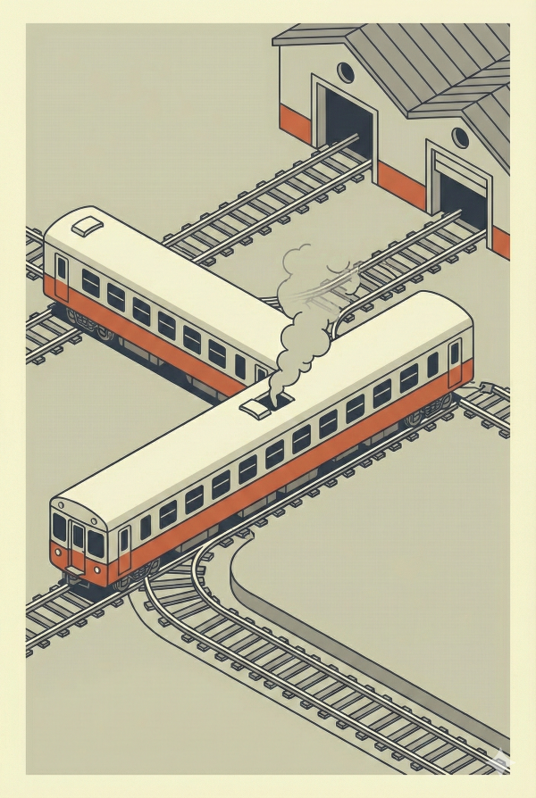
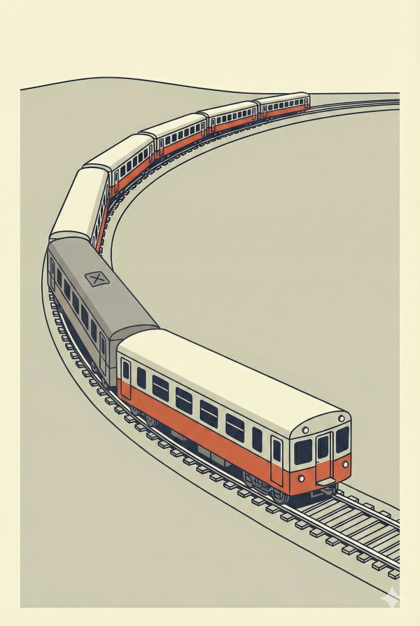
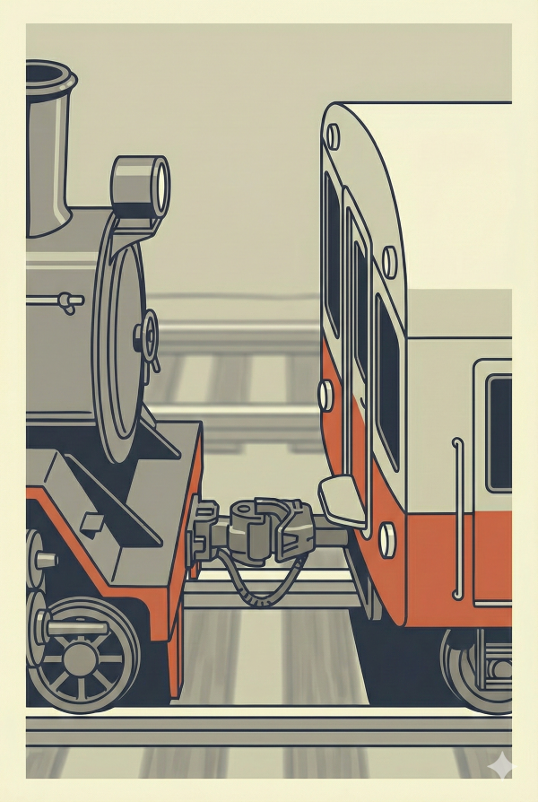
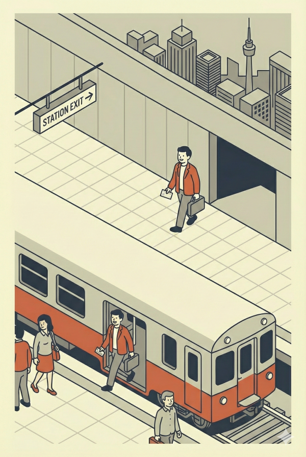
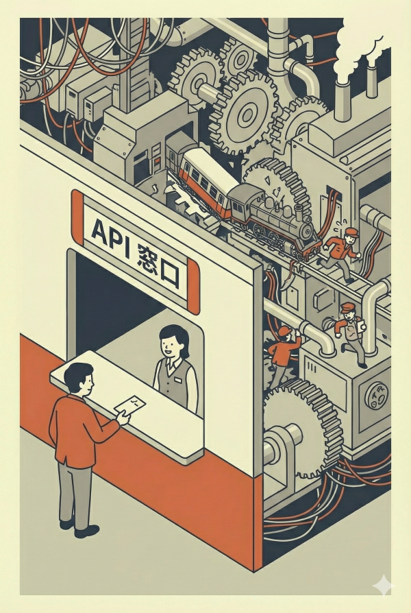

<!-- _class: title -->
<!-- _paginate: false -->


# 鉄道から学ぶアーキテクチャ #2
## 部品の独立性 — 交換可能な「車両」を作る

2026-01-27
ponpon.USA

---

<!-- _class: section -->
<!-- _paginate: false -->

## 前回の振り返り

---

<!-- _class: no-header all-text-center align-center -->

# 自由を捨てる勇気

<br>

### レール（制約）があるからこそ、時速300kmが出せる
### 標準規格（HTTP、JSON）があるからシステムが繋がる

<br>

## 今日は「レールの上を走る車両」に注目します
## なぜ電車は **分割** されているのか？

---

<!-- _class: section -->
<!-- _paginate: false -->

## #1 車両はなぜバラバラなのか？

---

<!-- _class: no-header all-text-center align-center -->

# 質問です

<br>

# なぜ電車は
# **1本の巨大な車両** ではないのか？

---

<!-- _class: align-center content-image-right content-60 no-header -->



# もし1本の巨大な車両だったら？

<br>

### 想像してみてください

<br>

* カーブを曲がれない
* 1箇所壊れたら**全滅**
* 編成を変えられない
* 車庫に入らない

---

<!-- _class: align-center content-image-left content-50 no-header -->



# だから「車両」で分割する

<br>

### 分割することで得られるもの

<br>

* カーブに対応できる（**柔軟性**）
* 1両壊れても他は動く（**耐障害性**）
* 混雑時に増結できる（**拡張性**）
* 故障車両だけ交換（**保守性**）

---

<!-- _class: no-header all-text-center align-center -->

# これは「モノリス vs マイクロサービス」と同じ

<br>

<div class="highlight-box">
  <b>モノリス（1本の巨大な車両）：</b> 全部入り、変更が全体に影響<br>
  <b>マイクロサービス（分割された車両）：</b> 独立して開発・デプロイ可能
</div>

<br>

## では、バラバラの車両がなぜ
## **一緒に走れる**のか？

---

<!-- _class: section -->
<!-- _paginate: false -->

## #2 連結器（インターフェース）の魔法

---

<!-- _class: align-center content-image-right content-50 no-header -->



# 連結器という「約束事」

<br>

### 蒸気機関車でも、最新の電気機関車でも、客車を引っ張れる

<br>

## なぜか？

---

<!-- _class: no-header all-text-center align-center -->

# 答え：連結器の「形」が同じだから

<br>

<div class="highlight-box">
  <b>連結器の形（Interface）</b> さえ合っていれば、<br>
  中身（動力源）が何であっても <span class="green-accent-text">連結できる</span>
</div>

<br>

## 蒸気でも、ディーゼルでも、電気でも
## 客車から見れば **「引っ張ってくれる何か」** でしかない

---

<!-- _class: no-header all-text-left align-center -->

# これが「ポリモーフィズム」の正体

<br>

```java
interface Locomotive {
    void pull(Car car);
}

class SteamLocomotive implements Locomotive { ... }
class ElectricLocomotive implements Locomotive { ... }
class DieselLocomotive implements Locomotive { ... }
```

<br>

### どの機関車でも `pull()` できる
### 客車は機関車の **中身を知らなくていい**

---

<!-- _class: align-center content-image-right content-70 no-header -->


# 実際のコードで見てみると

<br>

```typescript
interface PaymentGateway {
  charge(amount: number): Result;
}

class StripeGateway implements PaymentGateway { }
class PayPayGateway implements PaymentGateway { }
class CreditCardGateway implements PaymentGateway { }
```

<br>

* 決済手段が増えても**呼び出し側は変更不要**
* `charge()` さえ呼べば、中身は何でもいい

---

<!-- _class: section -->
<!-- _paginate: false -->

## #3 駅（API）の役割

---

<!-- _class: align-center content-image-right content-60 no-header -->



# 乗客は電車の運転方法を知らない

<br>

### でも、目的地に行ける

<br>

## なぜか？

---

<!-- _class: no-header all-text-center align-center -->

# 答え：「駅」という窓口があるから

<br>

<div class="highlight-box">
  <b>乗客（クライアント）</b> は、<br>
  <b>駅（API）</b> に行けば、<br>
  電車の仕組みを知らなくても目的地に行ける
</div>

<br>

## 駅は「内部の複雑さ」を隠蔽する
## **ファサード（窓口）** である

---

<!-- _class: align-center content-image-left content-50 no-header -->



# APIとは何か？

<br>

### Application Programming **Interface**

<br>

* 内部実装を**隠蔽**する
* 呼び出し側に**シンプルな窓口**を提供
* 内部が変わっても**外部への影響を最小化**

<br>

## 駅の改札が変わっても
## 乗客の「乗り方」は変わらない

---

<!-- _class: no-header all-text-center align-center -->

# 良いAPIの条件

<br>

### 1. **シンプル**：複雑な内部を隠す
### 2. **安定**：内部が変わっても外部は変わらない
### 3. **一貫性**：どの機能も同じ使い方

<br>

## 「駅員に聞かなくても乗れる」のが理想

---

<!-- _class: section -->
<!-- _paginate: false -->

## #4 まとめ

---

<!-- _class: no-header all-text-center align-center -->

# Key Takeaways

<br>

### 1. **分割することで柔軟性・保守性が上がる**
1本の巨大な車両より、連結された車両の方が強い

<br>

### 2. **インターフェースが「交換可能性」を生む**
連結器の形が合えば、中身は自由に交換できる

<br>

### 3. **API（駅）は複雑さを隠蔽する窓口**
利用者は内部の仕組みを知らなくていい

---

<!-- _class: no-header all-text-center align-center -->

# One more thing...

---

<!-- _class: no-header all-text-center align-center -->

# 今日の話を聞いて、こう思いませんでしたか？

<br>

# 「じゃあ、なんでも分割すればいいんだ」
# 「マイクロサービス最高！」

---

<!-- _class: no-header all-text-center align-center -->

# それが、最大の**罠**です

<br>

<div class="highlight-box">
  <b>問い：</b> 連結器（通信）が<span class="red-accent-text">増えすぎたら</span>どうなる？<br><br>
  <b>答え：</b> 列車は<span class="red-accent-text">遅くなる</span>
</div>

<br>

## **乗り換えが多すぎると、目的地に着くのが遅くなる**
## 連結部分（API呼び出し）の **オーバーヘッド** で破綻する

---

<!-- _class: no-header all-text-center align-center -->

# 分割の「適切な粒度」を見極める

<br>

### 分割しすぎ → 通信コスト爆発、デバッグ地獄
### 分割しなさすぎ → 変更困難、スケール不能

<br>

## これが「設計力」
## 正解はコンテキストによって変わる

---

<!-- _class: no-header all-text-center align-center -->

# 次回予告

<br>

# 鉄道から学ぶアーキテクチャ #3
## **衝突を防ぐ仕組み** — 信号機とダイヤグラム

<br>

### もし信号機がなかったら？
### 「排他制御」と「非同期処理」の本質に迫ります

---

<!-- _class: no-header all-text-center align-center -->

# レクチャーのお題

<br>

<div class="highlight-box">
  <b>【 課題 】</b><br>
  今日の内容を<span class="red-accent-text">「鉄道以外」</span>のメタファーで説明してください<br><br>
  <b>「連結器」「駅」に相当するものは、あなたの例えでは何ですか？</b>
</div>

<br>

## 持ち時間：5分
## 翌日以降に発表

---

<!-- _class: no-header all-text-center align-center -->

# **解散！！**
