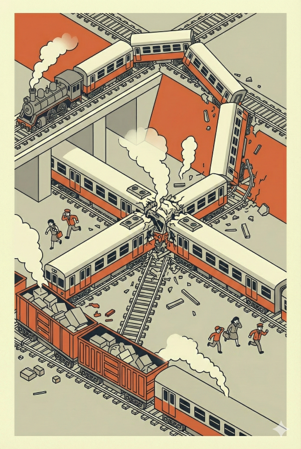
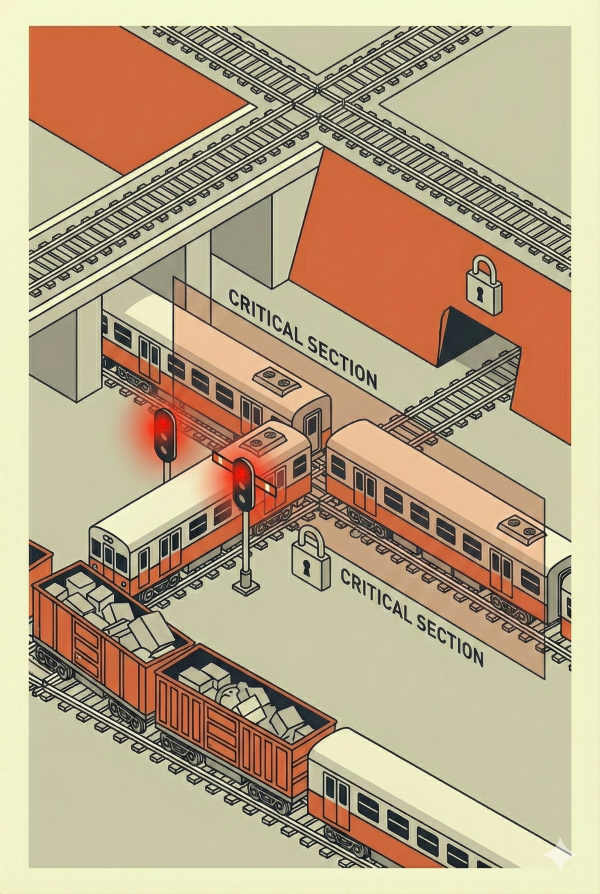
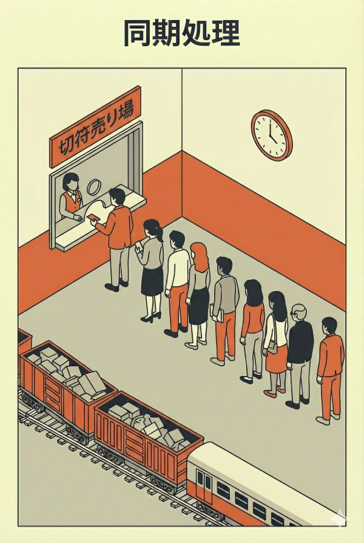
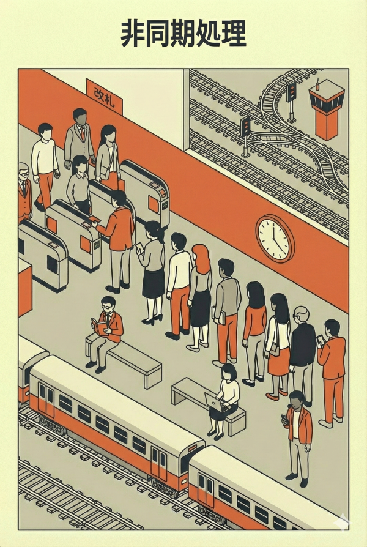
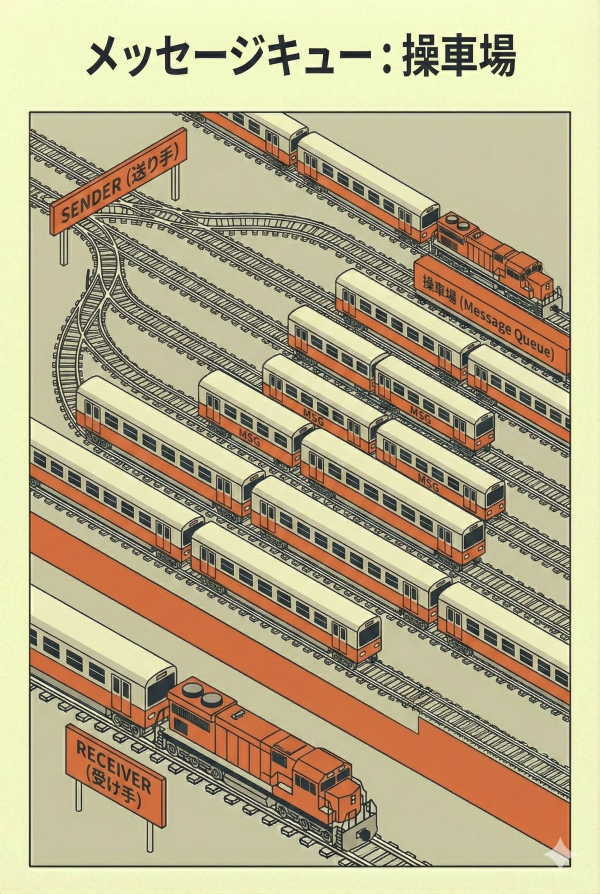
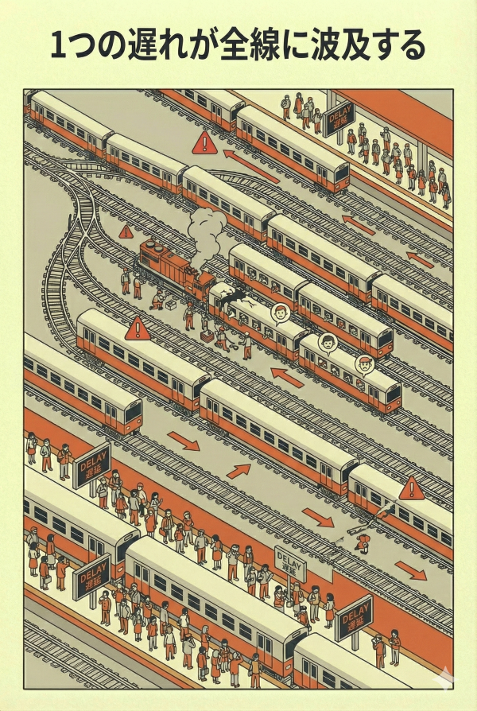
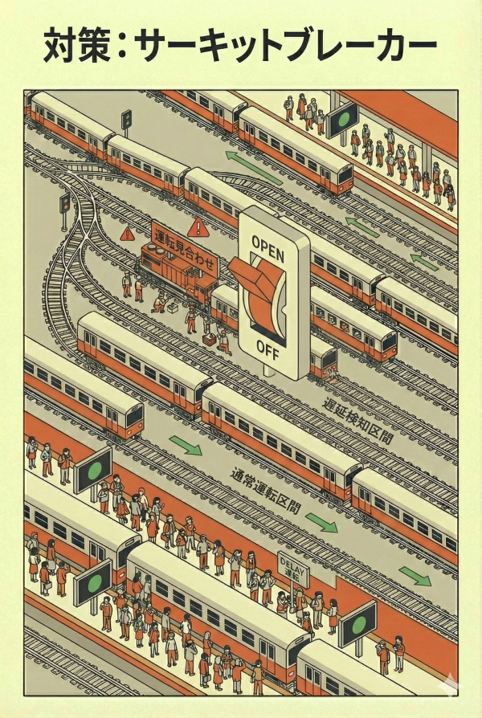

<!-- _class: title -->
<!-- _paginate: false -->


# 鉄道から学ぶアーキテクチャ #3
## 衝突を防ぐ仕組み — 信号機とダイヤグラム

2026-02-03
ponpon.USA

---

<!-- _class: section -->
<!-- _paginate: false -->

## 前回の振り返り

---

<!-- _class: no-header all-text-center align-center -->

# 部品の独立性

<br>

### 車両を分割することで柔軟性・保守性が上がる
### 連結器（インターフェース）が合えば交換可能
### 駅（API）は複雑さを隠蔽する窓口

<br>

## 今日は「複数の列車が同時に走る」ことに注目します
## なぜ列車は **衝突しない** のか？

---

<!-- _class: section -->
<!-- _paginate: false -->

## #1 もし信号機がなかったら？

---

<!-- _class: no-header all-text-center align-center -->

# 想像してください

<br>

# 信号機のない鉄道

<br>

## 複数の列車が同じレールを走っている
## 何が起きる？

---

<!-- _class: align-center content-image-right content-60 no-header -->



# 衝突（クラッシュ）

<br>

### 2つの列車が同じ区間に入ると...

<br>

* **正面衝突**
* **追突**
* **脱線**

<br>

## 取り返しのつかない事故が起きる

---

<!-- _class: no-header all-text-center align-center -->

# これは「データ競合」と同じ

<br>

<div class="highlight-box">
  <b>列車A：</b> 残高を読み取る → 1000円<br>
  <b>列車B：</b> 残高を読み取る → 1000円<br>
  <b>列車A：</b> 500円引いて書き込む → 500円<br>
  <b>列車B：</b> 300円引いて書き込む → 700円 <span class="red-accent-text">← おかしい！</span>
</div>

<br>

## 本当は200円のはずが、700円になっている
## **データが壊れた**

---

<!-- _class: align-center content-image-right content-60 no-header -->



# 解決策：信号機（排他制御）

<br>

### 閉塞区間（Critical Section）

<br>

* 1つの区間には**1つの列車しか入れない**
* 先に入った列車が出るまで**待つ**
* これが **Lock（ロック）** の本質

---

<!-- _class: no-header all-text-left align-center -->

# コードで見てみると

<br>

```java
synchronized (account) {  // 信号機を確保
    int balance = account.getBalance();  // 残高を読む
    account.setBalance(balance - 500);   // 残高を書く
}  // 信号機を解放
```

<br>

### `synchronized` = 「この区間には1つのスレッドしか入れない」
### 他のスレッドは **信号待ち** をする

---

<!-- _class: section -->
<!-- _paginate: false -->

## #2 ダイヤグラム（同期 vs 非同期）

---

<!-- _class: align-center content-image-right content-60 no-header -->



# 同期処理：切符売り場の行列

<br>

### イメージ

<br>

* 窓口は**1つ**
* 前の人が終わるまで**動けない**
* 全員が**順番待ち**

<br>

## シンプルだが、**遅い**

---

<!-- _class: align-center content-image-left content-50 no-header -->



# 非同期処理：ホームで待つ

<br>

### イメージ

<br>

* 改札を通ってホームへ
* 電車（Worker）が来たら乗る
* 待っている間も**他のことができる**

<br>

## 効率的だが、**複雑**

---

<!-- _class: no-header all-text-center align-center -->

# 同期 vs 非同期

<br>

<div class="highlight-box">
  <b>同期（Synchronous）：</b><br>
  処理が終わるまで待つ。シンプルだが遅い。<br><br>
  <b>非同期（Asynchronous）：</b><br>
  処理を依頼したら待たずに次へ。速いが複雑。
</div>

---

<!-- _class: align-center content-image-right content-60 no-header -->



# メッセージキュー：操車場

<br>

### RabbitMQ、Kafka、SQS...

<br>

* 列車（メッセージ）を一時的に**貯めておく**
* 処理できるときに**順番に取り出す**
* 送り手と受け手を**分離**できる

<br>

## 巨大な「操車場」がシステムを支える

---

<!-- _class: no-header all-text-center align-center -->

# なぜキューが必要か？

<br>

### 送り手と受け手の **速度差** を吸収する

<br>

```text
[注文システム] → [キュー] → [決済システム]
    100件/秒        ↓         10件/秒
              キューが溜める
```

<br>

## 決済が遅くても、注文は受け付けられる

---

<!-- _class: section -->
<!-- _paginate: false -->

## #3 遅延の伝播

---

<!-- _class: align-center content-image-right content-60 no-header -->



# 1つの遅れが全線に波及する

<br>

### 経験ありませんか？

<br>

* 「○○駅で人身事故」
* 「△△線で車両故障」
* → **全線ダイヤ乱れ**

<br>

## なぜ1箇所の問題が全体に影響する？

---

<!-- _class: no-header all-text-center align-center -->

# ブロッキングの連鎖

<br>

<div class="highlight-box">
  列車Aが遅れる<br>
  → 列車Bが信号待ち<br>
  → 列車Cが信号待ち<br>
  → 列車Dが信号待ち...<br><br>
  <span class="red-accent-text">1つの遅延が、後続すべてに伝播する</span>
</div>

<br>

## これは「同期処理の呪い」

---

<!-- _class: no-header all-text-center align-center -->

# ITシステムでも同じことが起きる

<br>

```text
[フロントエンド] → [API] → [認証サービス] → [DB]
                              ↑
                         ここが遅延
                              ↓
                    全部タイムアウト！
```

<br>

### 1つのサービスの遅延が
### **システム全体をダウン** させる

---

<!-- _class: align-center content-image-left content-50 no-header -->



# 対策：サーキットブレーカー

<br>

### 電車でいう「運転見合わせ」

<br>

* 遅延が検知されたら**切り離す**
* 他の区間は**通常運転を継続**
* 復旧したら**再接続**

<br>

## 被害を**局所化**する設計思想

---

<!-- _class: section -->
<!-- _paginate: false -->

## #4 まとめ

---

<!-- _class: no-header all-text-center align-center -->

# Key Takeaways

<br>

### 1. **信号機（排他制御）がないと衝突する**
同じリソースに同時アクセスすると、データが壊れる

<br>

### 2. **同期は遅い、非同期は複雑**
用途に応じて使い分ける。キューで速度差を吸収。

<br>

### 3. **1箇所の遅延が全体に波及する**
サーキットブレーカーで被害を局所化する

---

<!-- _class: no-header all-text-center align-center -->

# One more thing...

---

<!-- _class: no-header all-text-center align-center -->

# 今日の話を聞いて、こう思いませんでしたか？

<br>

# 「絶対に止まらないシステムを作ろう」
# 「遅延ゼロを目指そう」

---

<!-- _class: no-header all-text-center align-center -->

# それは、**不可能**です

<br>

<div class="highlight-box">
  <b>現実：</b> 鉄道も運休する。システムも落ちる。<br><br>
  <b>大事なのは：</b><br>
  「止まらないこと」より <span class="green-accent-text">「止まった時にどう復旧するか」</span><br>
  「エラーを出さないこと」より <span class="green-accent-text">「エラーをどう伝えるか」</span>
</div>

<br>

## **Resilience（回復力）** と **Error Handling（アナウンス）**

---

<!-- _class: no-header all-text-center align-center -->

# 「電車が止まりました」で終わらない

<br>

### 良いアナウンス（Error Handling）とは？

<br>

* **何が起きたか**（人身事故、車両故障）
* **いつ復旧するか**（見込み時間）
* **代替手段は何か**（振替輸送）

<br>

## ユーザーは「エラー」より「わからない」を嫌う

---

<!-- _class: no-header all-text-center align-center -->

# アナウンスの力

<br>

<div class="highlight-box">
  「ただいま信号確認を行っております」<br><br>
  <b>このアナウンスがあるだけで、<br>
  乗客（ユーザー）のストレスは<span class="green-accent-text">半減</span>する</b>
</div>

<br>

### ローディング表示、進捗バー、エラーメッセージ
### **「今何が起きているか」を伝える** ことがUXの基本

---

<!-- _class: no-header all-text-center align-center -->

# 次回予告

<br>

# 鉄道から学ぶアーキテクチャ #4
## **拡張と破壊** — 混雑との戦いとイノベーション

<br>

### 乗客が10倍になったらどうする？
### 「スケーラビリティ」の本質に迫ります

---

<!-- _class: no-header all-text-center align-center -->

# レクチャーのお題

<br>

<div class="highlight-box">
  <b>【 課題 】</b><br>
  今日の内容を<span class="red-accent-text">「鉄道以外」</span>のメタファーで説明してください<br><br>
  <b>「信号機」「ダイヤグラム」「遅延の伝播」に相当するものは？</b>
</div>

<br>

## 持ち時間：5分
## 翌日以降に発表

---

<!-- _class: no-header all-text-center align-center -->

# **解散！！**
