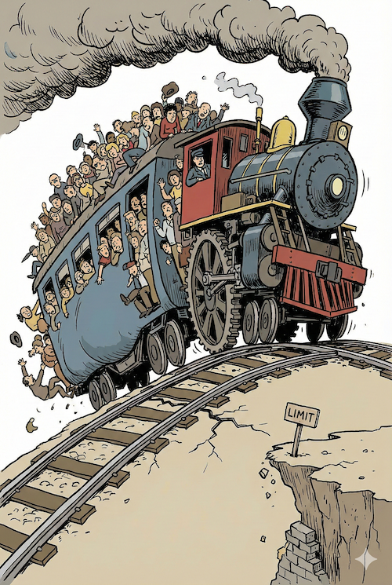
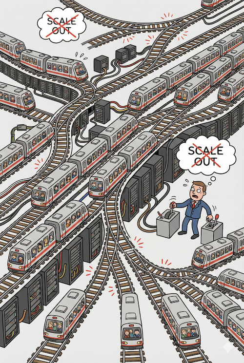
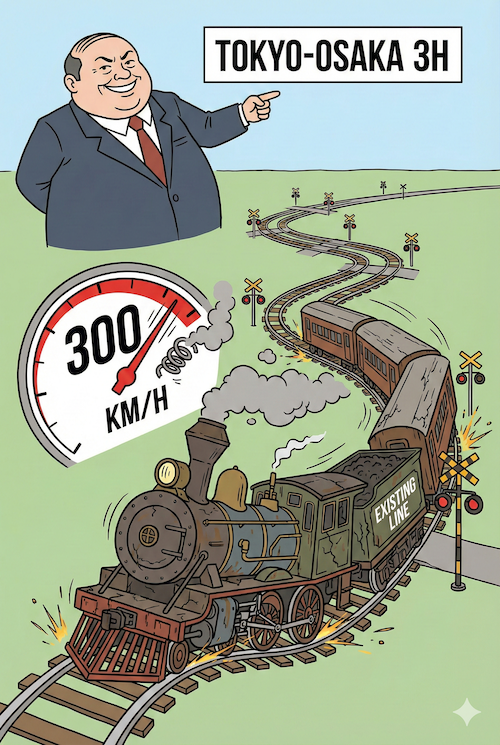
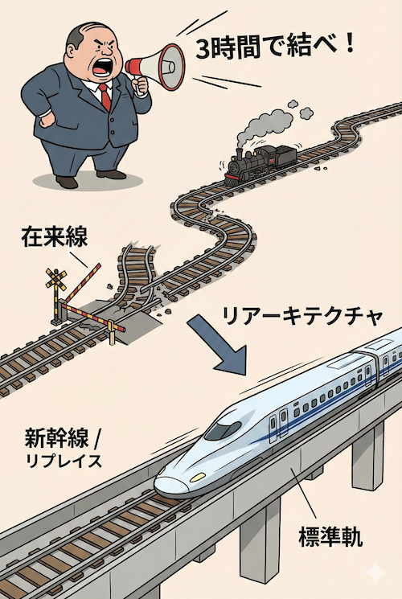
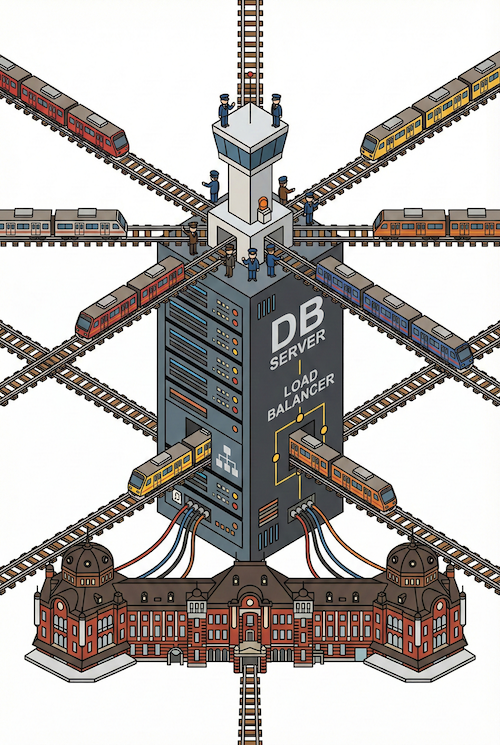
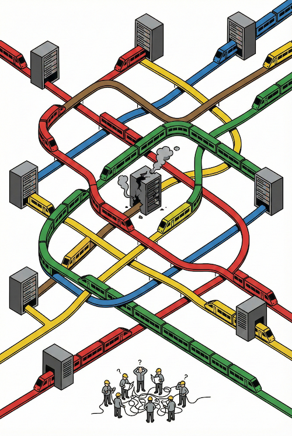

<!-- _class: title -->
<!-- _paginate: false -->

# 鉄道から学ぶアーキテクチャ #4
## 拡張と破壊 — 混雑との戦いとイノベーション

2026-02-17
ponpon.USA

---

<!-- _class: section -->
<!-- _paginate: false -->

## 前回の振り返り

---

<!-- _class: no-header all-text-center align-center -->

# 衝突を防ぐ仕組み

 

### 信号機（排他制御）がないと衝突する
### 同期は遅い、非同期は複雑
### 1箇所の遅延が全体に波及する

 

## 今日は「需要が増えた時」に注目します
## 乗客が **10倍** になったらどうする？

---

<!-- _class: section -->
<!-- _paginate: false -->

## #1 乗客が10倍になったらどうする？

---

<!-- _class: no-header all-text-center align-center -->

# 想像してください

 

# あなたの路線の利用者が
# **10倍** になった

 

## どうやって対応する？

---

<!-- _class: align-center content-image-right content-60 no-header -->

# 選択肢1：スケールアップ

 

### 車両を大きくする

 

* 1両あたりの定員を増やす
* より強力なエンジンに換装
* = サーバーの **スペック増強**

 

## シンプルだが、**限界がある**

---

<!-- _class: no-header all-text-center align-center -->

# スケールアップの限界

 

  <b>物理的限界：</b> ホームに入らない、トンネルを通れない 
  <b>コスト限界：</b> スペックを倍にしても、価格は倍以上 
  <b>単一障害点：</b> その1台が壊れたら全滅

 

## どこかで「天井」にぶつかる

---

<!-- _class: align-center content-image-left content-50 no-header -->

# 選択肢2：スケールアウト

 

### 本数を増やす / 複線化する

 

* 列車の数を増やす
* 線路を増設する
* = サーバーの **台数増加**

 

## 理論上は無限だが、**制御が難しい**

---

<!-- _class: no-header all-text-center align-center -->

# スケールアウトの難しさ

 

  <b>調整コスト：</b> 列車同士の調整（ロードバランシング） 
  <b>データ整合性：</b> どの列車に乗っても同じ目的地に着く？ 
  <b>運用コスト：</b> 監視対象が増える、障害箇所の特定が困難

 

## 「とりあえず増やす」だけでは破綻する

---

<!-- _class: no-header all-text-center align-center table-center table-font-large -->

# スケールアップ vs スケールアウト

 

| | スケールアップ | スケールアウト |
|---|---|---|
| 方法 | より大きく | より多く |
| 限界 | 物理的上限あり | 理論上は無限 |
| 複雑さ | 低い | 高い |
| コスト | 指数的に増加 | 線形に増加 |
| 障害時 | 全滅 | 一部のみ影響 |

 

## 正解は「どちらか」ではなく **組み合わせ**

---

<!-- _class: section -->
<!-- _paginate: false -->

## #2 破壊的イノベーション（新幹線）

---

<!-- _class: no-header all-text-center align-center -->

# ある日、経営陣が言った

 

# 「東京-大阪を **3時間** で結べ」

 

## 在来線で可能か？

---

<!-- _class: align-center content-image-right content-60 no-header -->

# 在来線の限界

 

### 既存のレールでは...

 

* カーブが多い → 減速が必要
* 踏切がある → 安全確保で減速
* 軌間（レール幅）が狭い → 安定しない

 

## **時速300km** は物理的に不可能

---

<!-- _class: align-center content-image-left content-50 no-header -->

# 解決策：別線を敷く

 

### 新幹線という選択

 

* 専用の直線ルート
* 踏切なし（立体交差）
* 標準軌（広いレール幅）

 

## **リプレイス / リアーキテクチャ**

---

<!-- _class: no-header all-text-center align-center -->

# これは「作り直し」である

 

  <b>在来線の改良：</b> 部分的な改善、既存資産を活かす 
  <b>新幹線の建設：</b> ゼロから設計、莫大な投資が必要

 

### 既存システムの「改修」では限界がある
### 本当に速くしたいなら「作り直し」が必要

 

## しかし、**コストと期間** は桁違い

---

<!-- _class: no-header all-text-center align-center -->

# 並行稼働の地獄

 

  <b>新幹線の工事中も、在来線は止められない</b>  
  古いシステムを動かしながら、新しいシステムを構築する 
  両方のメンテナンス、データ同期、切り替えタイミング...

 

## リプレイス案件を経験した人なら
## この辛さがわかるはず

---

<!-- _class: no-header all-text-center align-center -->

# 現実の選択

 

### すべてを新幹線にはできない

 

* 在来線は残り続ける（レガシー）
* 新幹線と在来線は **乗り換え** が必要
* 両方を運用し続けるコスト

 

## これが「技術的負債」との付き合い方

---

<!-- _class: section -->
<!-- _paginate: false -->

## #3 トポロジー（路線図）の設計

---

<!-- _class: align-center content-image-right content-60 no-header -->

# ハブ＆スポーク（中央集権型）

 

### 東京駅、新宿駅のような巨大ターミナル

 

* すべてが**中心**を通る
* 管理しやすい
* 中心が死ぬと**全滅**

 

## DBサーバー、ロードバランサー

---

<!-- _class: align-center content-image-left content-50 no-header -->

# メッシュ型（分散型）

 

### 直通運転、相互乗り入れ

 

* 中心を通らずに移動可能
* 1箇所が死んでも迂回できる
* **複雑**、調整コスト大

 

## マイクロサービス、P2P

---

<!-- _class: no-header all-text-center align-center -->

# どこに「ハブ」を置くか？

 

  トポロジー（路線図）の設計 = アーキテクチャ設計  
  <b>どこに集約するか</b>（DB、キャッシュ、LB） 
  <b>どこを分散させるか</b>（サービス、リージョン） 
  <b>どこで乗り換えさせるか</b>（API Gateway、BFF）

 

## この設計が、システムの **運命** を決める

---

<!-- _class: no-header all-text-center align-center -->

# 良いトポロジーの条件

 

### 1. **Single Point of Failureがない**
どこか1箇所が死んでも、全体は動き続ける

 

### 2. **ボトルネックが分散している**
特定のハブに負荷が集中しない

 

### 3. **変更の影響範囲が限定的**
1箇所の変更が全体に波及しない

---

<!-- _class: section -->
<!-- _paginate: false -->

## #4 シリーズ全体のまとめ

---

<!-- _class: no-header all-text-center align-center table-center table-font-large -->

# 4回を振り返って

 

| 回 | テーマ | 学び |
|---|---|---|
| #1 | 制約と標準化 | レールがあるから速く走れる |
| #2 | インターフェース | 連結器が合えば交換可能 |
| #3 | 排他制御と非同期 | 信号機がないと衝突する |
| #4 | スケーラビリティ | 限界を超えるには別線が必要 |

---

<!-- _class: no-header all-text-center align-center -->

# Key Takeaways

 

### 1. **スケールアップには限界がある**
いつかは「横に広げる」設計が必要になる

 

### 2. **本当に速くするなら「作り直し」も選択肢**
ただし、コストと期間は桁違い

 

### 3. **トポロジーがシステムの運命を決める**
どこにハブを置くか、の設計が最も重要

---

<!-- _class: no-header all-text-center align-center -->

# One more thing...

---

<!-- _class: no-header all-text-center align-center -->

# 技術（車両）は変わる

 

### 蒸気機関車 → 電気機関車 → リニア
### COBOL → Java → Go → ???

 

## 10年後、今の技術は「レガシー」かもしれない

---

<!-- _class: no-header all-text-center align-center -->

# でも、変わらないものがある

 

  <b>トポロジー（路線図）</b> の設計思想 
  <b>ルール（レール）</b> の決め方 
  <b>制約と自由</b> のバランス 
  <b>分割と統合</b> の判断基準

 

## これらは **言語やフレームワークを超えて** 使える

---

<!-- _class: no-header all-text-center align-center -->

# 次のステップへ

 

### この4回で学んだ「設計思想」を武器に

 

## 「なぜこのコードはこう書かれているのか？」
## 「なぜこのアーキテクチャが選ばれたのか？」

 

### を **自分で判断** できるエンジニアへ

---

<!-- _class: no-header all-text-center align-center -->

# 最後の問いかけ

 

  <b>AIが書いたコードを、そのまま信用していいか？</b>  
  → 設計思想と合致しているか、判断できる軸を持っているか？ 
  → レール（規約）に沿っているか、見抜ける目を持っているか？

 

## その軸があれば、AIは **最強の道具** になる
## なければ、AIに **振り回される** だけ

---

<!-- _class: no-header all-text-center align-center -->

# 最終レクチャーのお題

 

  <b>【 課題 】</b> 
  4回シリーズ全体を通して学んだことを 
  「自分の言葉」で5分間、発表してください  
  <b>鉄道以外のメタファーを使ってもOK</b>

 

## これが「出力」の総仕上げ

---

<!-- _class: no-header all-text-center align-center -->

# シリーズ完結

 

# お疲れ様でした！

 

## 次フェーズ：AI活用の実践へ

---

<!-- _class: no-header all-text-center align-center -->

# **解散！！**
