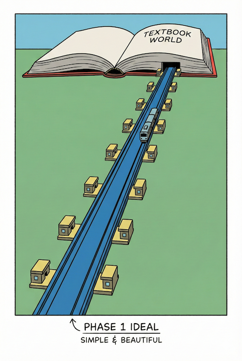

<!-- _class: title -->
<!-- _paginate: false -->


# ☕ Intermission
## 荒野の歩き方 — 理想の地図と、現実の獣道

2026-02-24
ponpon.USA

---

<!-- _class: section -->
<!-- _paginate: false -->

## Phase 1 の振り返り

---

<!-- _class: no-header all-text-center align-center table-center table-font-large -->

# 「鉄道から学ぶアーキテクチャ」で学んだこと

<br>

| 回 | メタファー | テーマ | 学び |
|---|---|---|---|
| #1 | **レール** | 制約と標準化 | レールがあるから速く走れる |
| #2 | **連結器** | インターフェース | 連結器が合えば交換可能 |
| #3 | **信号機** | 排他制御と非同期 | 信号機がないと衝突する |
| #4 | **新幹線** | スケーラビリティ | 限界を超えるには別線が必要 |

---

<!-- _class: no-header all-text-center align-center -->

# ここまでの話は...

<br>

# すべて **「整備された鉄道」** の話

<br>

### 障害物のない、綺麗に敷かれたレール
### 時刻通りに走る列車
### 理想的な路線図

---

<!-- _class: no-header all-text-center align-center -->

# でも、現実は？

---

<!-- _class: section -->
<!-- _paginate: false -->

## #1 路線図と実際の線路

---

<!-- _class: align-center content-image-right content-60 no-header -->



# 路線図（理想）

<br>

### Phase 1 で見てきた世界

<br>

* 直線的なルート
* 均等な駅間距離
* シンプルで美しい

<br>

## これが **「教科書」** の世界

---

<!-- _class: align-center content-image-left content-50 no-header -->


# 実際の線路（現実）

<br>

### 現場のコードはこうなっている

<br>

* 急勾配、急カーブ
* 老朽化した橋梁
* 先人が苦労して敷いた獣道

<br>

## これが **「現場」** の世界

---

<!-- _class: no-header all-text-center align-center -->

# エンジニアの仕事とは

<br>

<div class="highlight-box">
  <b>路線図（理想）</b> を見ながら、<br>
  <b>実際の線路（現実）</b> の状況に合わせて、<br>
  <b>安全なルート</b> を引くこと
</div>

<br>

## 路線図が間違っているわけではない
## 現実が悪いわけでもない
## **両方を見て判断する** のが我々の仕事

---

<!-- _class: section -->
<!-- _paginate: false -->

## #2 車両と路線設計は別物

---

<!-- _class: no-header all-text-center align-center -->

# よくある誤解

<br>

# 「最新の車両を入れれば速くなる」

<br>

## 本当にそうか？

---

<!-- _class: align-center content-image-right content-60 no-header -->


# 新型車両（技術スタック）

<br>

### Laravel, React, Docker, Kubernetes...

<br>

* 最新で高性能
* みんなが使っている
* 流行りの技術

<br>

## **「何を使うか」**

---

<!-- _class: align-center content-image-left content-50 no-header -->


# 路線設計（アーキテクチャ）

<br>

### 責務の分離、データの流れ、命名規則...

<br>

* 10年前も10年後も変わらない本質
* 言語やFWに依存しない
* **設計の意図**

<br>

## **「どう組むか」**

---

<!-- _class: no-header all-text-center align-center -->

# 新型車両を入れても...

<br>

<div class="highlight-box">
  <b>路線設計（アーキテクチャ）がダメなら、速く走れない</b><br><br>
  急カーブだらけの路線に新幹線を入れても、<br>
  減速しなければ脱線する
</div>

<br>

## 逆に言えば...

---

<!-- _class: no-header all-text-center align-center -->

# 旧型車両でも...

<br>

<div class="highlight-box">
  <b>路線設計（アーキテクチャ）が良ければ、ちゃんと走れる</b><br><br>
  素のPHP、古いMySQL、レガシーなサーバー...<br>
  それでも設計が良ければ、安定して動く
</div>

<br>

## 「Laravel使ってないからダメ」ではない

---

<!-- _class: no-header all-text-center align-center -->

# 道具のせいにするな

<br>

### 最高級の包丁があっても
### 料理人の腕（設計力）がなければ
### 料理は不味くなる

<br>

<div class="highlight-box">
  技術スタック（道具）と アーキテクチャ（設計）を<br>
  <span class="red-accent-text">混同するな</span>
</div>

---

<!-- _class: section -->
<!-- _paginate: false -->

## #3 廃線にできない在来線

---

<!-- _class: no-header all-text-center align-center -->

# ある日、経営陣が言った

<br>

# 「この路線、赤字だから廃止しよう」

---

<!-- _class: align-center content-image-right content-60 no-header -->


# 赤字路線の現実

<br>

### 表面的に見ると...

<br>

* 利用者が少ない
* 維持費がかかる
* 古くて非効率

<br>

## **「廃止すべき」に見える**

---

<!-- _class: align-center content-image-left content-50 no-header -->


# でも、廃止したら？

<br>

### 地域住民の足がなくなる

<br>

* 高齢者が病院に行けない
* 学生が通学できない
* 地域経済が死ぬ

<br>

## 実は **「地域の生命線」** だった

---

<!-- _class: no-header all-text-center align-center -->

# これは「レガシーコード」と同じ

<br>

<div class="highlight-box">
  <b>表面的に見ると：</b><br>
  「なんだこのクソコード」「古い」「読めない」「消したい」<br><br>
  <b>実は：</b><br>
  そのコードが <span class="green-accent-text">ビジネスを支えている</span>
</div>

---

<!-- _class: no-header all-text-center align-center -->

# チェスタトンの柵

<br>

### 道の真ん中に「謎の柵」がある
### 「邪魔だから壊そう」

<br>

## **待て。**

<br>

### なぜこの柵がここにあるのか？
### 理由がわからないなら、壊すな。

---

<!-- _class: no-header all-text-center align-center table-center table-font-large -->

# 想像力のワーク

<br>

### なぜ、この関数はこんなに長いのか？

<br>

| ❌ 短絡的な答え         | ⭕ 想像力のある答え                                                       |
| ---------------------- | ------------------------------------------------------------------------ |
| 技術力が低かったから   | 当時、超特急で機能追加しないと<br>サービスが停止する危機だったのかもしれない |
| 設計を知らなかったから | **会社を救った英雄的なコード** かもしれない                              |

---

<!-- _class: no-header all-text-left align-center -->

# 英雄的なコードの例

<br>

```php
if ($order_date < '2019-10-01') {
    $tax_rate = 0.08;
} else {
    $tax_rate = 0.10;
}
```

<br>

### 「なんだこの謎分岐、リファクタしよう」

<br>

## 実は：**消費税増税の瞬間に<br>サーバーを止めずに切り替えるための苦肉の策** だった

---

<!-- _class: no-header all-text-center align-center -->

# 失敗談

<br>

### 昔、先輩のコードを見て思った
### 「なんだこのクソコード。リファクタしよう」

<br>

## 結果：**本番障害**

<br>

### 後から聞いたら、あのコードには
### **「特定の顧客の特殊な要件」** が埋め込まれていた

---

<!-- _class: no-header all-text-center align-center -->

# 歴史へのリスペクト

<br>

<div class="highlight-box">
  レガシーコード = 技術的負債<br>
  ではない<br><br>
  レガシーコード = <span class="green-accent-text">ビジネスの歴史</span>
</div>

<br>

## 理由を調べてから、判断せよ

---

<!-- _class: section -->
<!-- _paginate: false -->

## #4 自動運転と運転士

---

<!-- _class: no-header all-text-center align-center -->

# 次のフェーズで手に入れるもの

<br>

# **AI（自動運転システム）**

<br>

### GitHub Copilot, ChatGPT, Claude...
### コードを書いてくれる強力な相棒

---

<!-- _class: align-center content-image-right content-60 no-header -->


# 自動運転システム（AI）

<br>

### 特徴

<br>

* 教科書通りに走る
* ルール（学習データ）に忠実
* 24時間疲れない

<br>

## **「正解」を知っている**

---

<!-- _class: no-header all-text-center align-center table-center table-font-large -->

# ⚠️ ただし注意

<br>

### 今のAIは **「自動運転レベル2」** くらい

<br>

| レベル | 名称 | 状態 |
|---|---|---|
| Level 5 | 完全自動運転 | 人間は寝ていてOK |
| Level 2 | **運転支援** | 人間が常に監視・介入必要 |

<br>

<div class="highlight-box">
  AIが「全部やってくれる」と思うと事故る<br>
  <span class="red-accent-text">ハンドルから手を離すな</span>
</div>

---

<!-- _class: align-center content-image-left content-50 no-header -->


# 運転士（人間）

<br>

### 特徴

<br>

* 「この区間は雨の日に滑る」を知っている
* 「この駅は乗降に時間がかかる」を知っている
* **現場の文脈（Context）** を持っている

<br>

## **「現実」を知っている**

---

<!-- _class: no-header all-text-center align-center -->

# AIにはできないこと

<br>

<div class="highlight-box">
  AIは「コードの汚さ」は指摘できる<br><br>
  でも、<span class="red-accent-text">「そのコードが生まれた文脈（Context）」</span>は知らない
</div>

<br>

### 文脈を知る人間が、「リスペクト」を持って接しない限り
### リファクタリングは **破壊行為** になる

---

<!-- _class: no-header all-text-center align-center -->

# AIは「優秀な新卒」

<br>

### 教科書的な正解を知っている
### でも、現場の事情を知らない

<br>

<div class="highlight-box">
  「君の提案は素晴らしい。<br>
  だが、今の現場は素のPHPで、DB接続はこうなっている。<br>
  <span class="green-accent-text">この制約の中で、その理想をどう実現できる？</span>」
</div>

<br>

## この対話ができるのが **シニアエンジニア**

---

<!-- _class: no-header all-text-center align-center table-center table-font-large -->

# 両者の協働が最強

<br>

|      | 自動運転（AI）   | 運転士（人間）   |
| ---- | ---------------- | ---------------- |
| 強み | 正解を知っている | 現実を知っている |
| 弱み | 文脈を知らない   | 疲れる、ミスする |
| 役割 | 理想を提示する   | 現実に翻訳する   |

<br>

## どちらかだけでは **事故る**

---

<!-- _class: section -->
<!-- _paginate: false -->

## #5 クロージング

---

<!-- _class: no-header all-text-center align-center -->

# Phase 2 で手に入れるもの

<br>

# 自動運転システム（AI）

<br>

### コードを爆速で書いてくれる
### 教科書的な正解を教えてくれる
### 強力な武器

---

<!-- _class: no-header all-text-center align-center -->

# でも、忘れるな

<br>

<div class="highlight-box">
  <b>運転士（人間）の判断力がなければ、事故を起こす</b><br><br>
  AIが出した「綺麗なコード」を<br>
  そのままコピペして「動かない」と嘆くのは二流
</div>

<br>

## 現実に翻訳する力が必要

---

<!-- _class: no-header all-text-center align-center -->

# 荒野を楽しめ

<br>

### 整った環境でコードを書くのは簡単だ

<br>

## でも、制約だらけの荒野で
## 理想の地図を片手に道を切り拓くのは
## **冒険** だ

---

<!-- _class: no-header all-text-center align-center -->

# Key Takeaways

<br>

### 1. **路線図（理想）と実際の線路（現実）は違う**
両方を見て判断するのがエンジニアの仕事

<br>

### 2. **車両（技術スタック）と路線設計（アーキテクチャ）を混同するな**
道具のせいにするな

<br>

### 3. **レガシーコードはビジネスの歴史**
理由を調べてから判断せよ

<br>

### 4. **AIと人間の協働が最強**
どちらかだけでは事故る

---

<!-- _class: no-header all-text-center align-center -->

# 今度こそ次のフェーズへ

<br>

# Phase 2：AI活用の実践

<br>

### 道具に頼るな、知恵を絞れ
### そして、AIと共に進もう

---

<!-- _class: no-header all-text-center align-center -->

# **解散！！**
